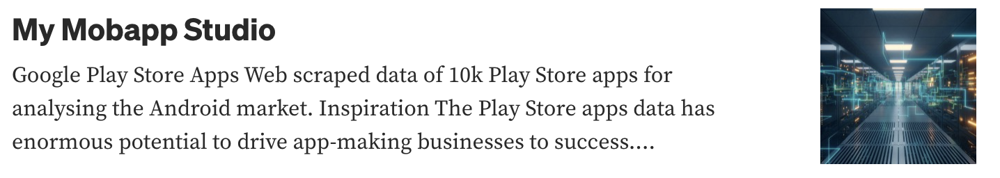
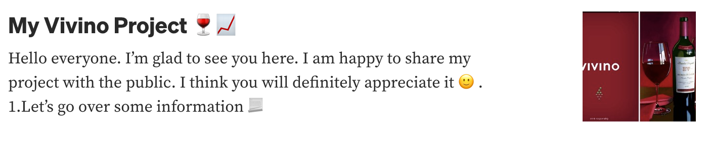

### Hi there 👋 I'm Jasur Abdibayev

	
- 🏢 **Campaigns**:
  - [Uc-coding.uz](https://uc-coding.uz/)
  - [Techno-Vision-Group](https://technovision.uz/)
- ⚡ **Fun Fact**: As a Python-Django Backend Developer, I enjoy building the backbone of web applications!
- 🎯 **Expertise**: Working with data warehouses, data analysis, visualization of finished data, Backend development with Python-Django
- 🔋 **My site**: [abd1bayev](https://abd1bayev.uz)
- 💬 **Ask me about**: [Telegram](https://t.me/abd1bayev)
- 📫 **How to reach me**: [Email](mailto:jasurabdibayev0@gmail.com)
- 📱 **Phone**:
  
  		+998 93 695 35 78 +998 99 695 35 78,

<h2>My Tech Stack</h2>
<table>

**Back-End**

**Databases**

**Front-End**

**Data Science**

**Tools**

**Learning**

</table>

<h2>My Recent posts on Medium!</h2>

<a target="_blank" href="https://medium.com/@jasurabdibayev0/my-mobapp-studio-1fe1fa0fb7f6"></img></a>

<a target="_blank" href="https://medium.com/@jasurabdibayev0/my-vivino-project-e405a9833e6d"></img></a>

 

	<strong>Consider giving my work a :star: to show some :heart:</strong>

   <i>A problem can be solved in a 100 different ways and There's always an easier way to solve a problem.</i>
    
   <i>You miss 100% of the shots you don't take.</i>
    
 
<a target="_blank" href="https://abd1bayev.vercel.app/"></img></a>	
<a target="_blank" href="https://www.linkedin.com/in/jasur-abdibayev-a94109241/"></img></a>
<a target="_blank" href="mailto:jasurabdibayev0@gmail.com"></img></a>
<a target="_blank" href="https://medium.com/@jasurabdibayev0"></img></a>

 

  

## 📊 GitHub Stats:

  
	 
  

