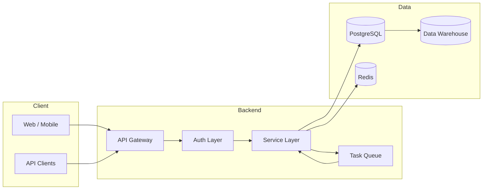

<!-- Generated by scripts/generate-readme.mjs — edit config/profile.json -->
<div align="center">

<!-- header -->


**Software Engineer** · Backend systems · Data engineering · Scalable architecture

Production-grade APIs, data pipelines, and backend systems built for reliability under real-world load.

`Software Engineer` @ [**Techno Vision Group**](https://technovision.uz/) · `Uzbekistan`

<br />

[](https://github.com/abd1bayev)
[](https://abd1bayev.uz)
[](https://www.linkedin.com/in/jasur-abdibayev-a94109241/)
[](https://t.me/abd1bayev)
[](mailto:jasurabdibayev0@gmail.com)

<br /><br />


</div>

---

## `profile.py`

```python
class Engineer:
    name: str = "Jasur Abdibayev"
    role: str = "Software Engineer"
    company: str = "Techno Vision Group"
    location: str = "Uzbekistan"
    focus: list[str] = ["Backend Engineering", "Data Engineering", "Infrastructure"]

    def build(self) -> "ProductionSoftware":
        return (
            self.design_apis()
            >> self.orchestrate_data()
            >> self.ship_reliably()
        )
```

---

## `architecture.mermaid`


```mermaid
flowchart LR
    subgraph Client
        WEB[Web / Mobile]
        API_C[API Clients]
    end

    subgraph Backend
        GW[API Gateway]
        AUTH[Auth Layer]
        SVC[Service Layer]
        Q[Task Queue]
    end

    subgraph Data
        DB[(PostgreSQL)]
        CACHE[(Redis)]
        DWH[(Data Warehouse)]
    end

    WEB --> GW
    API_C --> GW
    GW --> AUTH --> SVC
    SVC --> DB
    SVC --> CACHE
    SVC --> Q --> SVC
    DB --> DWH
```

---

## `modules/`

```python
from backend import BackendEngineering
from data import DataEngineering
from infra import Infrastructure
```

```python
# backend.py — Backend Engineering
# RESTful APIs, service layers, auth, async task orchestration
STACK = ["Python", "Django", "FastAPI", "DRF", "Celery"]

# data.py — Data Engineering
# ETL pipelines, warehousing, analytics, visualization
STACK = ["PostgreSQL", "Pandas", "NumPy", "Streamlit", "Plotly"]

# infra.py — Infrastructure
# Containers, Linux, CI/CD, message queues, caching
STACK = ["Docker", "Linux", "Git", "Redis", "RabbitMQ"]
```

---

## `stack.config.py`

```python
STACK: dict[str, list[str]] = {
    "languages": ["Python", "JavaScript", "SQL"],
    "backend": ["Django", "FastAPI", "Django REST Framework", "Flask", "Celery"],
    "data": ["PostgreSQL", "Redis", "Pandas", "NumPy", "Scikit-learn", "Jupyter"],
    "infrastructure": ["Docker", "Linux", "Git", "RabbitMQ"],
    "frontend": ["React", "Vue", "HTML", "CSS"]
}
```

<div align="center">

</div>

---

## `engineering.manifest.ts`

```typescript
export const PRINCIPLES = {
  clarity: "maintainability over clever abstractions",
  design: "testable, observable, evolvable systems",
  delivery: "iterate → measure → refine",
  boundaries: "strict separation of domain, infra, and presentation",
} as const;

type Principle = typeof PRINCIPLES[keyof typeof PRINCIPLES];
```

---

## `about/`

```bash
$ cat about.en.md
Software engineer focused on backend systems, data pipelines, and scalable architecture. I design services that remain stable under production load.

$ cat about.uz.md
Backend tizimlar, ma'lumotlar pipeline'lari va masshtablanadigan arxitektura ustida ishlaydigan muhandis. Production yuk ostida barqaror servislar yarataman.

$ cat about.ru.md
Инженер ПО: backend-системы, data pipeline, масштабируемая архитектура. Проектирую сервисы, стабильные под production-нагрузкой.
```

<details>
<summary><b>Multilingual bios</b></summary>

**EN** — Software engineer focused on backend systems, data pipelines, and scalable architecture. I design services that remain stable under production load.

**UZ** — Backend tizimlar, ma'lumotlar pipeline'lari va masshtablanadigan arxitektura ustida ishlaydigan muhandis. Production yuk ostida barqaror servislar yarataman.

**RU** — Инженер ПО: backend-системы, data pipeline, масштабируемая архитектура. Проектирую сервисы, стабильные под production-нагрузкой.

</details>

---

## `publications.json`

```json
[
  { "title": "My MobApp Studio", "topic": "Mobile Development", "url": "https://medium.com/@jasurabdibayev0/my-mobapp-studio-1fe1fa0fb7f6" },
  { "title": "My Vivino Project", "topic": "Project Case Study", "url": "https://medium.com/@jasurabdibayev0/my-vivino-project-e405a9833e6d" }
]
```

| id | topic | link |
|:---|:------|:-----|
| `my_mobapp_studio` | Mobile Development | [read →](https://medium.com/@jasurabdibayev0/my-mobapp-studio-1fe1fa0fb7f6) |
| `my_vivino_project` | Project Case Study | [read →](https://medium.com/@jasurabdibayev0/my-vivino-project-e405a9833e6d) |

---

## `GET /contact`

```bash
$ curl -s https://abd1bayev.uz/api/contact | jq
```

```json
{
  "name": "Jasur Abdibayev",
  "portfolio": "https://abd1bayev.uz",
  "website": "https://abd1bayev.vercel.app",
  "github": "https://github.com/abd1bayev",
  "linkedin": "https://www.linkedin.com/in/jasur-abdibayev-a94109241/",
  "medium": "https://medium.com/@jasurabdibayev0",
  "telegram": "https://t.me/abd1bayev",
  "email": "jasurabdibayev0@gmail.com"
}
```

<div align="center">

[](https://abd1bayev.uz)
[](https://abd1bayev.vercel.app)
[](https://www.linkedin.com/in/jasur-abdibayev-a94109241/)
[](https://medium.com/@jasurabdibayev0)
[](https://t.me/abd1bayev)
[](mailto:jasurabdibayev0@gmail.com)

<br /><br />

```
────────────────────────────────────────────
  Built with clean code · Maintained via CI
  Source: config/profile.json
────────────────────────────────────────────
```

</div>
