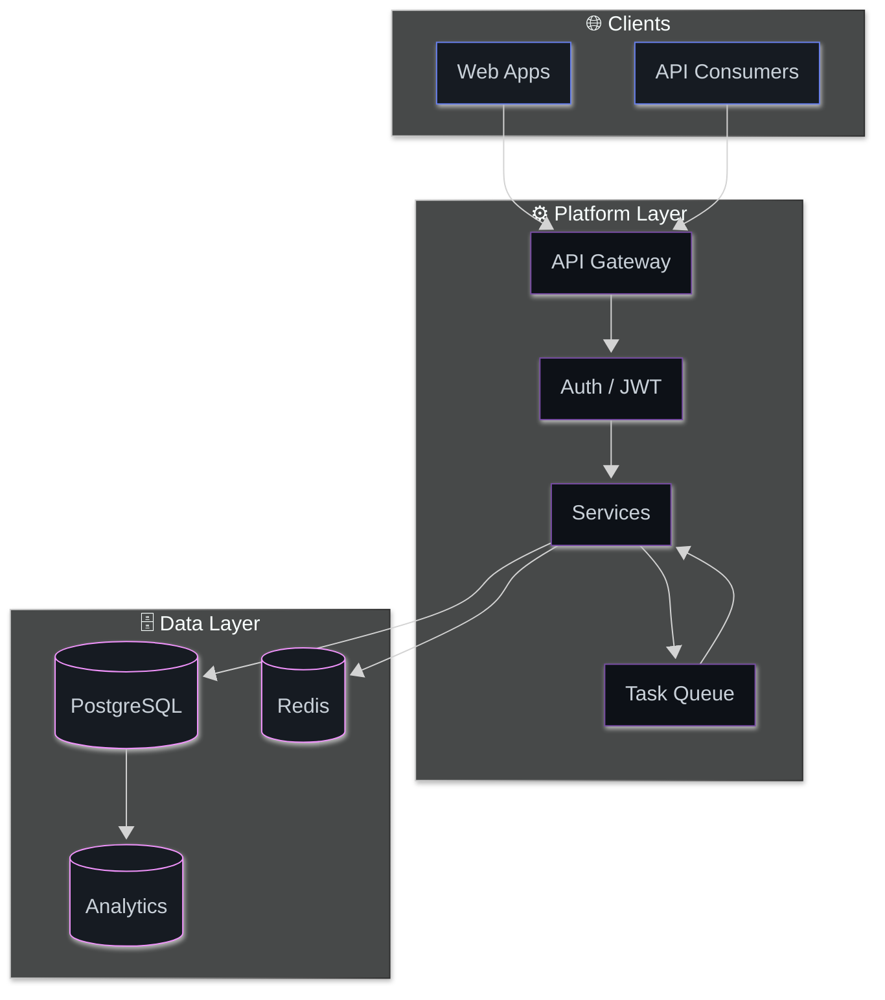

<!-- Generated by scripts/generate-readme.mjs — edit config/profile.json -->
<div align="center">


<br />

### Jasur Abdibayev

`Software Engineer` @ [**Techno Vision Group**](https://technovision.uz/) · `Uzbekistan` · `UTC+5`

Production-grade APIs, data pipelines, and backend systems — engineered for reliability under real-world load.

<br />

[](https://github.com/abd1bayev)
[](https://abd1bayev.uz)
[](https://www.linkedin.com/in/jasur-abdibayev-a94109241/)
[](https://t.me/abd1bayev)
[](mailto:jasurabdibayev0@gmail.com)

<br /><br />


</div>

> [!IMPORTANT]
> Building backend & data systems at Techno Vision Group

> [!TIP]
> Open to collaboration:
> > - Backend engineering
> - Data pipelines
> - System architecture

---

## Overview

<table width="100%">
<tr>
<td width="50%" valign="top">

**`profile.py`**

```python
from dataclasses import dataclass
from typing import Self

@dataclass(frozen=True, slots=True)
class Engineer:
    name: str = "Jasur Abdibayev"
    role: str = "Software Engineer"
    company: str = "Techno Vision Group"
    location: str = "Uzbekistan"
    focus: tuple[str, ...] = ("Backend Engineering", "Data Engineering", "Infrastructure")

    def pipeline(self) -> Self:
        return self.design_apis().orchestrate_data().ship()
```

</td>
<td width="50%" valign="top">

**`stats.json`**


</td>
</tr>
</table>

---

## `architecture.mermaid`


```mermaid
---
config:
  theme: dark
  look: neo
---
flowchart TB
    subgraph Clients["🌐 Clients"]
        WEB[Web Apps]
        API_C[API Consumers]
    end

    subgraph Platform["⚙️ Platform Layer"]
        GW[API Gateway]
        AUTH[Auth / JWT]
        SVC[Services]
        Q[Task Queue]
    end

    subgraph Storage["🗄️ Data Layer"]
        DB[(PostgreSQL)]
        CACHE[(Redis)]
        DWH[(Analytics)]
    end

    WEB --> GW
    API_C --> GW
    GW --> AUTH --> SVC
    SVC --> DB & CACHE
    SVC --> Q --> SVC
    DB --> DWH

    classDef client fill:#161b22,stroke:#667eea,color:#c9d1d9
    classDef platform fill:#0d1117,stroke:#764ba2,color:#c9d1d9
    classDef storage fill:#161b22,stroke:#f093fb,color:#c9d1d9
    class WEB,API_C client
    class GW,AUTH,SVC,Q platform
    class DB,CACHE,DWH storage
```

---

## `modules/`

<table width="100%">
<tr>
<td width="33%" valign="top">

**`backend/`**

```python
# Backend Engineering
# RESTful APIs, service layers, auth, async task orchestration
TECH = ["Python", "Django", "FastAPI", "DRF", "Celery"]
```

</td>
<td width="33%" valign="top">

**`data/`**

```python
# Data Engineering
# ETL pipelines, warehousing, analytics, visualization
TECH = ["PostgreSQL", "Pandas", "NumPy", "Streamlit", "Plotly"]
```

</td>
<td width="33%" valign="top">

**`infra/`**

```python
# Infrastructure
# Containers, Linux, CI/CD, message queues, caching
TECH = ["Docker", "Linux", "Git", "Redis", "RabbitMQ"]
```

</td>
</tr>
</table>

---

## `stack.config.toml`

```toml
[stack]
languages = ["Python", "JavaScript", "SQL"]
backend   = ["Django", "FastAPI", "Django REST Framework", "Flask", "Celery"]
data      = ["PostgreSQL", "Redis", "Pandas", "NumPy", "Scikit-learn", "Jupyter"]
infra     = ["Docker", "Linux", "Git", "RabbitMQ"]
frontend  = ["React", "Vue", "HTML", "CSS"]
```

<div align="center">


</div>

---

## `engineering.manifest.ts`

> [!NOTE]
> Engineering principles that guide every system I build.

```typescript
export const PRINCIPLES = {
  clarity: "maintainability over clever abstractions",
  design: "testable, observable, evolvable systems",
  delivery: "iterate → measure → refine",
  boundaries: "strict separation of domain, infra, and presentation",
} as const satisfies Record<string, string>;

export type Principle = (typeof PRINCIPLES)[keyof typeof PRINCIPLES];
```

---

## `about/`

<details open>
<summary><b>🇬🇧 English</b></summary>
<br />

> Software engineer focused on backend systems, data pipelines, and scalable architecture. I design services that remain stable under production load.

</details>

<details>
<summary><b>🇺🇿 O'zbek</b></summary>
<br />

> Backend tizimlar, ma'lumotlar pipeline'lari va masshtablanadigan arxitektura ustida ishlaydigan muhandis. Production yuk ostida barqaror servislar yarataman.

</details>

<details>
<summary><b>🇷🇺 Русский</b></summary>
<br />

> Инженер ПО: backend-системы, data pipeline, масштабируемая архитектура. Проектирую сервисы, стабильные под production-нагрузкой.

</details>

---

## `publications.json`

```json
[
  { "title": "My MobApp Studio", "topic": "Mobile Development", "url": "https://medium.com/@jasurabdibayev0/my-mobapp-studio-1fe1fa0fb7f6" },
  { "title": "My Vivino Project", "topic": "Project Case Study", "url": "https://medium.com/@jasurabdibayev0/my-vivino-project-e405a9833e6d" }
]
```

| Article | Topic | Link |
|:--------|:------|:-----|
| **My MobApp Studio** | Mobile Development | [Read →](https://medium.com/@jasurabdibayev0/my-mobapp-studio-1fe1fa0fb7f6) |
| **My Vivino Project** | Project Case Study | [Read →](https://medium.com/@jasurabdibayev0/my-vivino-project-e405a9833e6d) |

---

## `activity.graph`


---

## `GET /api/v1/contact`

```yaml
openapi: 3.1.0
info:
  title: Contact API
  version: 1.0.0
paths:
  /contact:
    get:
      summary: Reach Jasur Abdibayev
      responses:
        "200":
          content:
            application/json:
              schema:
                properties:
                  portfolio: { type: string, example: "https://abd1bayev.uz" }
                  github:    { type: string, example: "https://github.com/abd1bayev" }
                  linkedin:  { type: string, example: "https://www.linkedin.com/in/jasur-abdibayev-a94109241/" }
                  telegram:  { type: string, example: "https://t.me/abd1bayev" }
                  email:     { type: string, example: "jasurabdibayev0@gmail.com" }
```

<div align="center">

[](https://abd1bayev.uz)
[](https://abd1bayev.vercel.app)
[](https://www.linkedin.com/in/jasur-abdibayev-a94109241/)
[](https://medium.com/@jasurabdibayev0)
[](https://t.me/abd1bayev)
[](mailto:jasurabdibayev0@gmail.com)

<br /><br />

<sub>config-driven · CI validated · <code>npm run generate</code></sub>

</div>
